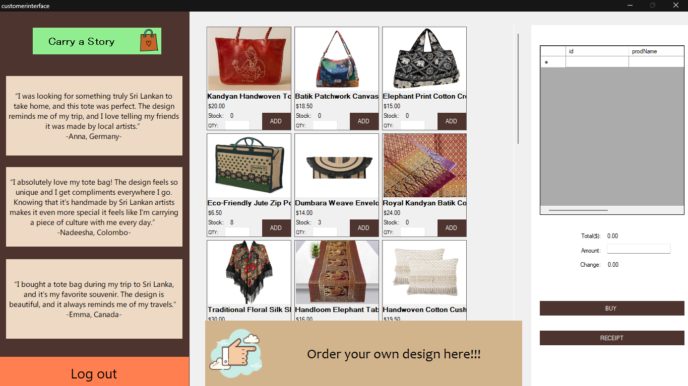
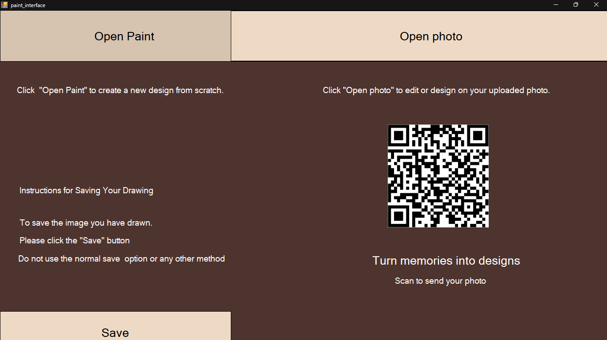
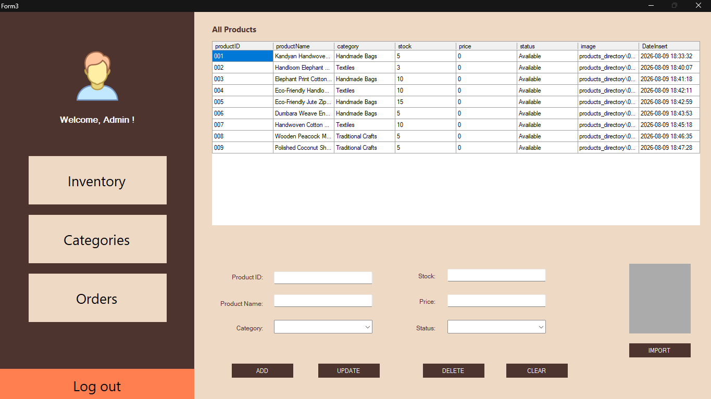
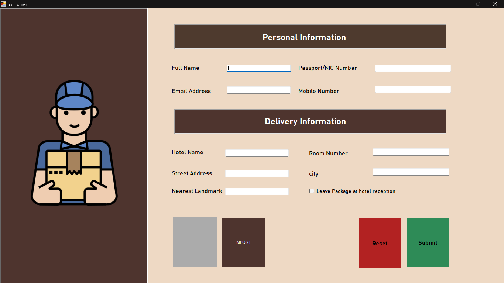

<div align="center">

# 🌿 Ceylon Roots
### *Artisan Desktop POS, Inventory Management & Custom Kiosk Suite*

[](https://learn.microsoft.com/en-us/dotnet/csharp/)
[](https://dotnet.microsoft.com/)
[](https://learn.microsoft.com/en-us/dotnet/desktop/winforms/)
[](https://www.sqlite.org/)
[](LICENSE)

<br/>

### 🎓 University Coursework Project
**Academic Module:** 1st Year — Object-Oriented Programming (OOP) with C#  
**Core Competencies:** Layered desktop architecture, offline-first SQLite persistence, interactive GDI+ digital canvas graphics, and dual-language localization (EN / DE).

<br/>

**A multi-tier desktop enterprise application engineered in C# WinForms for artisan retail, unifying point-of-sale checkout, real-time inventory management, localized multi-language customer kiosks, and an interactive digital customizer studio.**

<br/>

</div>

---

## 📷 Application Preview

<div align="center">
  <table border="0" style="width:100%; text-align:center;">
    <tr>
      <td width="50%" align="center" valign="top">
        <h3>🛒 Point of Sale & Storefront</h3>
        
      </td>
      <td width="50%" align="center" valign="top">
        <h3>🎨 Interactive Canvas Bag Designer</h3>
        
      </td>
    </tr>
    <tr>
      <td width="50%" align="center" valign="top">
        <h3>📦 Seller Inventory Management</h3>
        
      </td>
      <td width="50%" align="center" valign="top">
        <h3>🚚 Customer Delivery & Order Fulfillment</h3>
        
      </td>
    </tr>
  </table>
</div>

---

## 📌 Executive Summary

Artisan retail businesses frequently struggle with fragmented tooling: separate software for inventory tracking, cashier billing, and personalized custom-order intake.

**Ceylon Roots** provides an all-in-one, offline-resilient desktop management suite tailored for handcrafted Sri Lankan goods. The system integrates real-time inventory controls, an interactive customer-facing product personalization studio, dual-language localization (English & German), and high-throughput POS checkout—all powered by an automated, zero-configuration local SQLite data engine.

### 💡 Architectural Evolution & Design Decisions (ADR)
* **🗄️ Database Modernization (Azure SQL ➔ Zero-Setup Embedded SQLite):**  
  The application was initially engineered with **Microsoft Azure SQL Database** for cloud synchronization. To ensure zero-dependency local evaluation, offline resilience, and fast testability, the persistence layer was modernized to an embedded **SQLite (`System.Data.SQLite`)** engine that automatically bootstraps the local database (`app_data.db`) on startup.

---

## ✨ Key System Features

### 🛒 1. Dynamic Point of Sale (POS) & Storefront
* **Interactive Product Grid**: Dynamically renders reusable product card UI components (`cardProduct.cs`) populated directly from the database.
* **Real-Time Cart Operations**: Live price calculations, automated stock boundary validations, and dynamic quantity modifications.
* **Order Processing & Receipts**: Instant customer invoice generation, transaction recording, and receipt history tracking.

### 📦 2. Seller Dashboard & Inventory Management
* **Comprehensive CRUD**: Add, edit, archive, and update artisan goods with high-resolution image uploads.
* **Category Taxonomy**: Dynamic categorisation with multi-attribute filtering and live text search.
* **Stock Health Tracking**: Automated stock alerts, inventory status flags (`Available` / `Out of Stock`), and historical transaction audit trails.

### 🎨 3. Interactive Custom Artisan Studio (Kiosk Customizer)
* **Embedded Digital Canvas**: GDI+ and system canvas integration enabling customers to sketch custom artwork on tote bags in real-time.
* **Smart Artwork Isolation**: Intelligent canvas cropping algorithm that automatically strips editor toolbars to isolate artwork.
* **QR Code Tracking**: Generates unique QR verification markers linked directly to customer delivery records for automated fulfillment.

### 🌐 4. Multi-Language Localization (i18n)
* **Dual-Language Architecture**: Native English and German (`de-DE`) localization implemented via compiled satellite `.resx` resource dictionaries.
* **Dynamic Culture Switching**: Instant runtime interface translation across all forms without application restarts.

### 💾 5. Zero-Configuration Offline-First Data Layer
* **Automated SQLite Engine**: Automatically provisions and bootstraps `app_data.db` upon first launch, eliminating complex manual SQL server setup.
* **Graceful Schema Migrations**: Safe, idempotent table creation and column addition routines ensuring seamless updates across deployments.

---

## 🏗️ Architecture & Technology Stack

```
┌─────────────────────────────────────────────────────────────┐
│                       Presentation Layer                    │
│   LauncherForm  •  SellerDashboard  •  shopForm  •  Form3   │
│   (WinForms • Custom Controls • GDI+ Rendering • i18n .resx) │
└──────────────────────────────┬──────────────────────────────┘
                               │
┌──────────────────────────────▼──────────────────────────────┐
│                    Business & State Layer                   │
│         categoriesList  •  productList  •  orders           │
└──────────────────────────────┬──────────────────────────────┘
                               │
┌──────────────────────────────▼──────────────────────────────┐
│                      Data Access Layer                      │
│                  DbHelper.cs (ADO.NET)                      │
└──────────────────────────────┬──────────────────────────────┘
                               │
┌──────────────────────────────▼──────────────────────────────┐
│                         Persistence                         │
│                    SQLite Database Engine                   │
└─────────────────────────────────────────────────────────────┘
```

| Technology | Purpose |
|---|---|
| **C# (.NET Framework 4.7.2+)** | Core programming language & runtime execution |
| **Windows Forms (WinForms)** | Desktop GUI presentation and custom component rendering |
| **System.Data.SQLite** | High-performance, zero-config embedded SQL database |
| **GDI+ / System.Drawing** | Interactive digital drawing canvas and smart image cropping |
| **.NET Resource System (`.resx`)** | Compiled multi-language internationalization (English / German) |
| **AxWMPLib / WMPLib** | Native multimedia playback integration for promotional videos |

---

## 📂 Repository Structure

```plaintext
ceylon-roots-csharp-desktop/
├── images/
│   ├── shop.png                      # POS storefront & product catalog preview
│   ├── canvas_bag_painter.png        # Interactive GDI+ bag painter customizer
│   ├── inventory_management.png      # Vendor inventory & stock dashboard
│   └── customer_checkout.png         # Delivery details & order checkout
├── WindowsFormsApp1/
│   ├── WindowsFormsApp1/
│   │   ├── DbHelper.cs               # SQLite schema bootstrap, migrations & connection provider
│   │   ├── LauncherForm.cs           # Main application entry point & portal router
│   │   ├── shopForm.cs               # Dynamic POS store, cart manager & receipt generator
│   │   ├── cardProduct.cs            # Reusable custom UI card component for catalog items
│   │   ├── SellerDashboard.cs        # Seller administrative portal
│   │   ├── InventoryForm.cs          # Stock control, product CRUD & image upload engine
│   │   ├── sellercategories.cs       # Category taxonomy manager
│   │   ├── paint_interface.cs        # Interactive GDI+ tote bag drawing canvas
│   │   ├── customer.cs               # Customer checkout & delivery intake flow
│   │   ├── orders.cs                 # Order fulfillment & transaction ledger
│   │   ├── Resources/                # Application iconography and localized assets
│   │   └── App.config                # Runtime configuration
│   └── WindowsFormsApp1.sln          # Visual Studio solution file
├── .gitignore                        # Clean Visual Studio & local database ignore rules
└── README.md                         # Project documentation
```

---

## 👨‍💻 My Role & Key Contributions

As a core developer on this project, I architected and implemented the core functional workflows that drive the application:

* **POS Storefront & Shopping Cart (`shopForm.cs`, `cardProduct.cs`)**:
  * Engineered the dynamic product catalog that instantiates custom UI card components with image bindings at runtime.
  * Implemented real-time cart calculation algorithms, quantity steppers, and stock validation boundaries.
  * Built the automated receipt generation and transaction completion flow.
* **Seller Inventory Management System (`SellerDashboard.cs`, `InventoryForm.cs`, `sellercategories.cs`)**:
  * Designed the administrative dashboard UI and structured navigation workflows.
  * Built complete CRUD operations for artisan products, including dynamic category associations and file-system image ingestion.
  * Implemented real-time data grid filtering, low-stock visual cues, and state persistence.
* **Customer Intake & Order Fulfillment Pipeline (`customer.cs`, `orders.cs`)**:
  * Formulated customer information validation and order linking logic.
  * Built the order history and status tracking interfaces for back-office fulfillment.
* **Database Architecture & Migration (`DbHelper.cs`)**:
  * Contributed to the migration and stabilization of the data layer from remote Azure SQL to a resilient, standalone SQLite embedded architecture with automatic schema provisioning.

---

## 🚀 Getting Started

### Prerequisites
* Windows 10 / 11
* Visual Studio 2022 (or 2019) with **.NET desktop development** workload installed
* .NET Framework 4.7.2 or higher

### Installation & Run

1. **Clone the repository:**
   ```bash
   git clone https://github.com/chinthanasathyajithcs/ceylon-roots-csharp-desktop.git
   cd ceylon-roots-csharp-desktop
   ```

2. **Open the Solution:**
   * Double-click `WindowsFormsApp1/WindowsFormsApp1.sln` to open in Visual Studio.

3. **Restore Packages:**
   * In Visual Studio, right-click the Solution in Solution Explorer and select **Restore NuGet Packages** (or run `Update-Package -reinstall` via Package Manager Console if needed).

4. **Build and Launch:**
   * Set configuration to `Debug` or `Release` with target platform `Any CPU` / `x86`.
   * Press **F5** or click **Start**.
   * *The application will automatically initialize the local SQLite database (`app_data.db`) on its initial run.*

---

## 📄 License

This project is licensed under the [MIT License](LICENSE) - see the LICENSE file for details.
